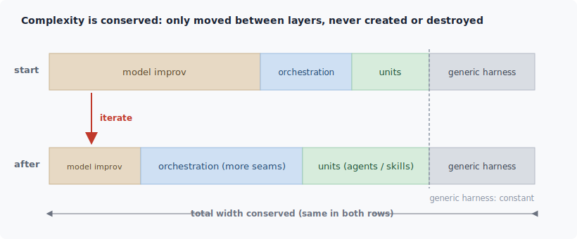
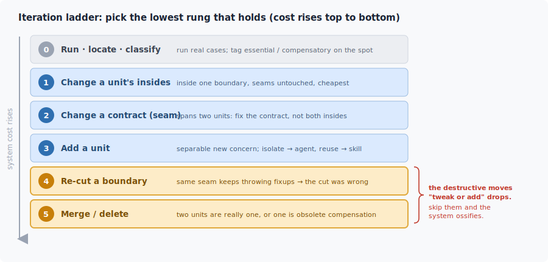

**English** | [中文](README.zh.md)

# Harness Iteration Methodology: Discovering New Complexity While Staying Agile

## 1. Core Essence: Three Fundamental Facts That Reshape Multi-Agent Pipelines

In practice, developers often assume their core task is to "design a perfect domain harness or a perfect pipeline," or to "narrow the constraints of the domain harness and make it more specialized." In reality, designing for a complex business domain on top of a large language model (LLM) is fundamentally constrained by the following three facts:

- **Fact 1: Complexity Conservation**
  The essential complexity of a business requirement is fixed and cannot be conjured away. In a multi-agent system, complexity can only be shifted between three layers: the **generic harness (the platform's base loop)**, the **orchestration layer (the topology and seams of the domain harness)**, and the **unit layer (the internals of agents and skills)**.
  - *Generic harness*: handles the general loop of context retrieval, model resolution, tool execution, and so on; it carries no domain logic. It is really a floor that slowly rises: occasionally the platform turns some generic capability into a native one, and at that point a human must step in to delete the corresponding capability from inside the domain harness. This layer is outside the developer's influence, so it is not the main thread.
  - *Domain harness*: made up of the pipeline topology, seams, and units that the developer customizes. This is the focus of this discussion. When we use carefully crafted prompts to compress "the fuzzy boundary of the model's free improvisation," the complexity does not evaporate; it moves upward into the pipeline's orchestration and unit contracts. As a result, the system evolves such that "the leaves gradually converge (each model call gets narrower) while the trunk keeps expanding (the number of seams and units grows)."

- **Fact 2: Unpredictable Complexity**
  The boundary behavior of an LLM under a specific prompt cannot be exhaustively enumerated through pure static design before it goes live. This overturns the traditional software waterfall model of "design comprehensively first, then build the pipeline." The first artifact we deliver should not be a static pipeline, but an **"observation instrument" that can continuously observe and cheaply discover the model's dynamic complexity.**
- **Fact 3: Shifting Foundation**
  The underlying foundation of traditional software (the operating system, the CPU, compiled languages) is relatively stable, whereas model capabilities are evolving rapidly and non-linearly. Every design decision is essentially a wager against "the capability boundary of the current model." The "compensatory code" we write to accommodate the current model's flaws depreciates rapidly as the model improves (its half-life is extremely short); only abstractions of the business essence keep appreciating over time.

Combining these three points, the problem we need to solve surfaces: we are not building a pipeline once and for all; we are running the pipeline, colliding with problems, discovering new complexity, and then iterating on the whole system continuously, driven by results.

---

## 2. Resistance to Evolution: Seven Anti-Patterns That Rot the System

Under the interplay of the fundamental facts above, seven typical problems arise during day-to-day iteration, quietly pushing the architecture toward decay:

1. **Silent Rot and Semantic Drift at the Seams**

Units can only communicate through contracts, so complexity tends to pile up at the "seams" between units. The most dangerous form of rot is "silent degradation" (all interface tests pass, yet the system as a whole has effectively collapsed):

- *Semantic Drift*: field names and types are unchanged, but the underlying business meaning has been quietly altered.
- *Shadow Contract*: both ends privately depend on a hidden signal that is never written into the explicit contract.
- *Duct-tape effect*: every time a boundary error is fixed, a special-case patch is applied, and the tape keeps getting thicker.
- *Fake validation*: the validation logic is superficial, checking only that a field exists (its type), not that the business meaning is correct.

2. **Over-Engineering: Mistaking "Internal Solutions" for "External Boundaries" and Locking Them Down**

Out of anxiety about unknown complexity, developers tend to hard-code "exactly how to do it (the How)" inside a work unit, scripting into rigid steps what should have been left to the model's reasoning. This directly suppresses the model's judgment and makes the architecture extremely brittle.

3. **Unbounded Accumulation of Technical Debt (the Compensation Ratchet)**

When the model stumbles in a specific new scenario, developers habitually wrap a "defensive unit" around it to compensate. Later, when the base model improves and the original flaw is fixed, few people go back to clean up these old patches, and the system ends up full of ineffective accommodations for "last-generation model quirks."

4. **Cascading Amplification of Errors and "Over-Compliance"**

An LLM's failure is usually not a thrown exception that crashes, but "a confidently wrong answer" (hallucination). Models are inherently over-compliant and eager to help (they would rather fabricate than proactively admit "I can't do this"). In a pipeline with N stages of handoff, the overall reliability of the system degrades exponentially in a cascade (0.95^N), and an upstream error easily disguises itself as high-quality input and poisons everything downstream.

5. **Asymmetry of Verification Cost and the Missing Yardstick**

The cost for a model to generate content that "looks right" is extremely low, but the cost of mechanically and automatically verifying that it is "absolutely correct" is very high, and many real tasks lack an objective binary yardstick for right and wrong. The correct approach is to invest the effort in making correctness verifiable; when there is no reference answer, design a reliable substitute: adversarial review, cross-evaluation from several perspectives, and placing humans in the right positions to act as gates.

6. **Context Window Crowding and Dilution (Context Crowding)**

There is a temptation to stuff everything into the context window, but stuffing in more is not the same as better; it dilutes the information density, distracts the model, and causes the "lost in the middle" phenomenon. Context requires careful "cost accounting."

7. **Boundary Ossification Caused by "Only Modify, Never Delete"**

If day-to-day iteration only permits non-destructive actions like "modify" and "add," the system will instinctively avoid the high-risk action of "re-cutting business boundaries," which only ossifies the earliest boundary errors ever deeper. "Re-cut, merge, delete" must also become actions available in daily use.

---

## 3. Breaking the Deadlock: Design Principles and Engineering Discipline for the Domain Harness

To counter the decay above, the core delivery standard should be: **a cheap, always-on, highly agile complexity-discovery mechanism, supported by the engineering discipline of "designing for detachability."**

### 3.0 Turn "Building" into a "Discovery Loop"

Do not try to imagine the structure out of thin air; instead, establish a cheap "discovery loop":

1. Pick a minimal, real, end-to-end case.
2. Run it for real through the current pipeline.
3. Watch for the points where "a human or the model has to improvise on the spot" and where "some seam repeatedly needs patching" (this is the undiscovered complexity).
4. Classify it on the spot with the thought experiment below, and record it at the lowest commitment layer that can bear it. Add no structure that has not been forced out by a real failure.

> **Core yardstick (Essence vs Compensation):** Assume the base model is perfectly reliable and infinitely capable, while the business domain logic remains word-for-word unchanged. Is this structure still needed?
>
> - **Yes → Essential complexity (Essence)**: it is an inevitable part of the domain logic and will appreciate as the system evolves.
> - **No → Compensatory complexity (Compensation)**: it merely accommodates a temporary weakness of the current model and is a "dead crutch" that must be cleaned up in the future.

**[Grounding discipline]** Whenever you introduce any "compensatory complexity," you must nail down three things at the same time:

- **Why**: which specific flaw of the current model does it intercept?
- **Removal trigger**: at what level of certainty in the base model can this structure be safely removed?
- **Removal probe (Reverse Regression Test)**: write a minimal case that reproduces the flaw. It is a kind of **reverse regression test**—an ordinary regression test turns red when code is accidentally deleted, whereas a removal probe turns **green** when "the compensation is switched off and the model, running bare, still passes the case." Once it turns green, it immediately signals to the developer to remove this obsolete crutch.

### 3.1 Tighten the Physical Boundary, Release the Internal Solution (Declare the 'What', Guide the 'How')

The domain harness is responsible for constraining boundaries, and the model is responsible for improvising within them. A good instruction for a high-performing agent should not provide rigid step-by-step footprints, but rather **a ring of guardrails** and **a yardstick for acceptance**:

- **What must be explicit (the guardrails and the yardstick)**: the role's perspective/bias, the input/output contract (schema), assertions about the nature of the output (verifiable output invariants), absolute prohibitions, and an **exception-admission mechanism** (strictly no hallucinated fabrication; report proactively when stuck).
- **What should be released (the solution)**: the ordering of internal reasoning, and the paths for multi-perspective exploration. Let the model self-align against the acceptance yardstick; only such a unit is naturally resistant to aging across model versions.

### 3.2 Seam Governance: Turn Silent Drift into Loud Failure

The core principle for governing interface rot is: **turn silent semantic drift into loud, immediate Fail-Fast blocking.**

| **Governance dimension** | **Ideal healthy state** | **Signal of a decay anti-pattern** |
| --- | --- | --- |
| **Form of validation** | Executable, forcibly triggered every time data crosses the seam | A spec written in prose inside a prompt, that no one re-reads |
| **Depth of validation** | Deeply asserts **business meaning** and **invariant constraints** | Only checks the field type (Type) or whether a key exists |
| **Mode of failure** | Fail immediately, close the boundary, and raise a loud alarm | Force-cast types, fill in defaults, truncate strings, and keep feeding poison downstream |
| **Contract owner** | A single owner (usually the downstream consumer defines the interface expectations) | Shared ownership, both ends adapting, and in the end both ends rot together |
| **Source of rules** | Every contract constraint is backed by a real failure case and marked Essence/Compensation | A pile of guard logic of unknown origin, imagined off the top of one's head |
| **Interface width/frequency** | The interface stays narrow and stable | The interface is very wide and needs changing on every iteration (a sign the cut is in the wrong place) |

> **Critical red line**: a seam may refuse to execute (Fail), but it **must never fabricate default data and feed poison downstream**. Force-casting, filling in defaults, and forcing alignment are all ways of feeding poison to downstream systems in the dark.
>
> **Health metric**: when a seam quietly changes its meaning, how many real cases must run before it turns red and reports an error? The ideal answer is: **1 case**.

### 3.3 Regulate the Ownership of "HOW": Avoid Handing the LLM a Fixed Recipe

In a pipeline, "hard-coded steps (HOW)" have three different sedimentation paths, two of which are correct and one of which is fundamentally wrong:

1. **Deterministic HOW (correct path)**: if a step is 100% deterministic, sediment it directly into hard code (a script or a gate). The model does not read from it; it invokes it directly as a Tool.
2. **Judgment-requiring HOW (correct path)**: if a step requires case-by-case judgment, then **cut it into sub-boundaries and equip each sub-boundary with its own acceptance yardstick.** This is essentially a micro-pipeline that leaves the judgment to the model within each sub-boundary.
3. **Prose steps with no gate (wrong path - recipe mode)**: writing a string of prose guidance steps for a task that requires complex judgment, while equipping it with no validation gate. It can neither be downgraded to deterministic code, nor is it willing to hand judgment to the model, and it cannot verify itself.

> **Decision thought experiment (guidance vs recipe):** if the model ignored the steps you gave it, but its output perfectly passed the final validation gate, would you be satisfied?
>
> - **Satisfied**: this means the steps are merely "advice" and the gate is the "law"; this is a healthy **method mode**.
> - **Not satisfied**: this means the steps have become the sole standard of right and wrong. The root cause is the lack of a runnable automated gate. Add a gate here, and the steps are immediately demoted from "law" to "advice," so this unit can produce good results across all models.

### 3.4 The Orthogonal Roles of Agent and Skill: Opposite Physical Operations on Context

The two are extremely similar in their engineering expression (boundaries, contracts, gates), but in their control of the context window they perform **exactly opposite** physical actions:

- **Agent (context subtractor)**: aims to establish isolation. It opens an independent, clean context window, keeps the messy intermediate derivation and "dirty work" digested inside, and finally pours back only the high-density distilled result into the main window.
- **Skill (context adder)**: aims to inject capability. It injects a deterministic method, tool, or code snippet into the current window, granting the current environment a new capability, with the core goal of cross-scenario reuse.

  | **Core requirement scenario** | **Recommended choice** | **Architectural behavior** |
  | --- | --- | --- |
  | **Only isolation needed**, no reuse or deterministic code | **Agent** | Opens an independent clean window and keeps intermediate derivation digested internally |
  | **Only reuse / deterministic code needed**, no isolation | **Skill** | Injects a deterministic tool or code snippet directly into the current window |
  | **Both isolation and reuse** and deterministic code needed | **Empty-shell Agent wrapping a Skill** | Use the Agent to block context, use the Skill to provide reuse capability |
  | **Neither isolation nor reuse** needed | **Merge directly** | Build no unit at all; write it inline directly into the caller's instructions |

**[Safety defense]** Beware "abstraction collapse"—copying a reusable Skill method (such as a knowledge-base retrieval step) as inline prose into the instructions of multiple Agents. This means that once the upstream changes, the local adaptations all rot in sync.

### 3.5 Introduce a Comprehensive "Iteration Ladder"

System evolution cannot be limited to a choice between "modifying old code" and "adding a new unit." We must establish a complete evolution ladder. From top to bottom, the cost and risk of reworking the system increase, and we should always **prefer the lowest rung that solves the problem**:

> **Architectural warning**: a pipeline that has long lacked rung 4 and rung 5 (re-cut, merge, delete) actions will, without exception, degrade into an unmaintainable "load-bearing wall." When running a real case gets more expensive and the call stack gets blurry on failure, that is the system urging you to repay its structural debt through higher-rung actions.

### 3.6 Elastic Declarative Design Oriented Toward "Iterative Deletion"

Because the underlying foundation keeps rising, the system must never grind away at a design aimed at some fixed "final state," but must instead be designed toward "**the capability for continuous iterative deletion (Molting)**":

- All gates must be modular and individually decouplable and removable.
- Contracts must be written as **declarative data (Schema)**, never as nailed-down control-flow code.
- The pipeline orchestration must stay highly clear, so that when the base model "grows up" enough to make the correct judgment on its own, the developer can safely delete an entire historical stage of scaffolding and smoothly hand the capability back down to the generic base.

---

## 4. Summary: Core Observable Metrics

Whether an LLM-based multi-agent system is good **does not depend on how many features it has piled up right now, but on how small the marginal cost is each time it responds to a change in the business or an upgrade of the model.**

In daily engineering practice, we need not fall into grand narratives; we need only keep our eyes on two minimal, objective metrics:

1. **The complexity-discovery loop is cheap enough**: running a real end-to-end case is fast enough, the call stack is clear enough on failure, and the fix, re-cut, and delete actions are light enough.
2. **The seam assertions are agile enough**: once the meaning of some seam quietly drifts, can we achieve a **100% immediate turn-red error** on the next real case run.

Keep the instrument agile and keep the crutches detachable, and the system can achieve elegant self-evolution on the continuously shifting foundation of large models.
