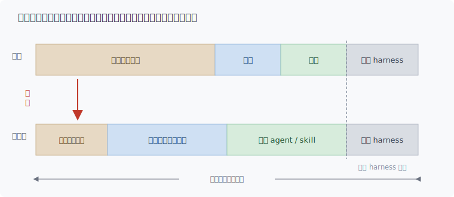
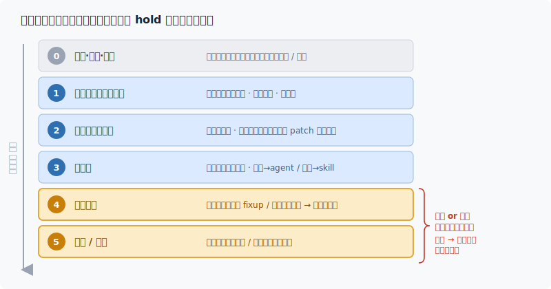

[English](README.md) | **中文**

# Harness 迭代方法论：发现新的复杂度并保持敏捷

## 1. 核心本质：重塑多 Agent 流水线的三个基本事实

在实践中，开发者常误以为自己的核心任务是“设计一套完美的领域 harness 或一条完美的流水线”或“将领域 harness 的约束收窄、变得更加专业”。然而，基于大语言模型（LLM）的复杂业务领域设计，本质上受到以下三个根本事实的制约：

- **事实一：复杂度守恒（Complexity Conservation）**
  业务需求的本质复杂度是既定且无法被凭空消灭的。在多 Agent 系统中，复杂度只能在三个层级之间转移：**通用 Harness（平台底层 Loop）**、**编排层（领域 Harness 的拓扑与接缝）** 以及 **单元层（Agent 与 Skill 内部）**。
  - *通用 Harness*：负责上下文取调、模型解析、工具执行等通用循环，不承载领域逻辑。它其实是块会慢慢升高的地板：平台偶尔把某个通用能力做成原生能力，那时需要人介入把领域 harness 内部对应的能力删掉。这部分非开发者所能影响的，因此不是主线。
  - *领域 Harness*：由开发者定制的流水线拓扑、接缝与单元构成。是我们这次讨论的重点。当我们通过精细的 Prompt 压缩“模型自由发挥的模糊边界”时，复杂度并没有蒸发，而是向上搬运到了流水线的编排与单元契约中。因此，系统演进会呈现出“叶子逐渐收敛（每次模型调用极窄），主干拼命扩张（接缝和单元数量增长）”。

- **事实二：复杂度不可预知（Unpredictable Complexity）**
  LLM 在特定 Prompt 下的边界表现，在上线前是无法通过纯静态设计穷尽的。这颠覆了传统软件“先全面设计、后流水线建造”的瀑布流模式。我们交付的第一产物，不应该是静态的流水线，而应该是一台**能持续观测、低成本发现模型动态复杂度的“观测仪器”**。
- **事实三：移动的技术地基（Shifting Foundation）**
  传统软件的底层地基（操作系统、CPU、编译语言）相对稳固；而大模型能力则处于高速、非线性的演进中。每一次设计决策，本质上都是在对“当前模型的能力边界”进行博弈。我们在迁就当前模型缺陷时所做的“补偿性编码”会随着模型升级而迅速贬值（半衰期极短），唯有对业务本质的抽象才会持续升值。

结合以上三点，我们需要解决的问题浮上水面：我们不是在搭一条一劳永逸的流水线，而是在运行过程中去撞上问题，发现新的复杂度，然后以结果为导向，持续对整套系统进行迭代。

---

## 2. 演进阻力：导致系统腐化的七大反模式

在上述基本事实的相互作用下，系统在日常迭代中会出现 7 类典型问题，悄悄将架构推向腐化：

1. **接缝处的隐蔽腐化与语义漂移（Semantic Drift）**

单元之间只能靠契约（Contract）通信，导致复杂度往往堆积在单元与单元之间的“接缝”处。最危险的腐化是“无声的变坏”（接口测试都能通过，但整套系统本身实质崩塌）：

- *语义漂移*：字段名和类型未变，但底层业务含义已被悄悄篡改。
- *影子契约*：两端私下依赖未在明文契约中写出的隐藏暗号。
- *胶带效应*：每修复一次边界错误就贴一个特例补丁，越贴越厚。
- *虚假校验*：校验逻辑流于表面，只验证字段存在性（Type），不验证业务意思的正确性。

2. **过度工程：误把“内部解法”当成“外部边界”予以收束**

出于对未知复杂度的焦虑，开发者容易将“具体怎么做（How）”写死在工作单元内部，把原本需要模型发挥推理能力的环节脚本化（Scripting）为硬性步骤。这直接压制了模型的判断力，导致架构极其脆弱。

3. **技术债的无限堆叠（补偿棘轮效应）**

当模型在特定新场景栽跟头时，开发者会习惯性地在外围包裹一层“防御性单元”进行补偿。等底层模型升级、原有缺陷被修复时，这些旧的补丁却鲜有人回头清理，最终导致系统充斥着对“上一代模型毛病”的无效迁就。

4. **误差的级联放大与“过度顺从”**

LLM 的失败往往不是抛出异常崩溃，而是“一脸自信地给出错误答案”（幻觉）。大模型天生具备过度顺从、乐于帮忙的特质（宁可编造也不愿主动认怂说“我不行”）。在 N 级流转的流水线中，系统的整体可靠性呈指数级级联下降（0.95^N），上一级的误差极易伪装成高性能输入向下游投毒。

5. **验证成本的非对称性与判尺缺失**

模型生成“看着对”的内容成本极低，但机械化、自动化地校验其“绝对正确”的成本极贵，许多真实任务甚至缺乏二元对错的客观判尺。正确的做法是要把工夫花在把正确性做成可检验上；没有标准答案，就设计靠得住的替代：对抗复核、几个视角互评、把人摆到合适的位置把关。

6. **上下文窗口的拥挤与稀释（Context Crowding）**

什么都想往上下文窗口里塞，但塞得越多不等于越好，会导致信息浓度被稀释、模型走神以及“中间内容遗忘”现象。上下文需要精细的“成本核算”。

7. **“只改不删”导致的边界固化**

如果日常迭代只允许“修改”和“新增”这种非破坏性动作，系统会本能地规避“重新切分业务边界”这一高危动作，这样只会把最早的边界错误越固化越深。得让「重切、合并、删除」也成为日常能用的动作。

---

## 3. 破局之道：领域 Harness 的设计原则与工程纪律

为了对抗上述腐化，核心交付标准应该是：**一套廉价、常开、高敏捷度的复杂度发现机制，辅以“面向可拆卸设计”的工程纪律。**

### 3.0 将“建造”转变为“发现循环”

不要试图凭空想象结构，而应建立廉价的“发现循环”：

1. 挑选一个最小的、真实的端到端 Case。
2. 用当前的流水线真实跑一遍。
3. 盯住那些“人或模型不得不临场发挥”以及“某道缝反复需要打补丁”的点（这就是未被发现的复杂度）。
4. 当场通过以下思维实验进行归类，记到能扛住的最低承诺层。没被真实失败逼出来的结构，一律不加。

> **核心判尺（本质 vs 补偿）：** 假设底层模型完美可靠、能力无穷，而业务领域逻辑一字未变，该结构是否依然需要？
>
> - **是 → 本质复杂度（Essence）**：它属于领域逻辑的必然组成，会随着系统演进而升值。
> - **否 → 补偿复杂度（Compensation）**：它只是在迁就当下模型的临时弱点，属于未来必须清理的“废拐杖”。

**【落地纪律】** 引入任何“补偿复杂度”时，必须同步钉死三要素：

- **Why**：具体拦截了当前模型的哪项缺陷？
- **拆除触发条件**：基座模型达到何种确定性指标时，该结构可以被安全移除？
- **拆除探针（Reverse Regression Test）**：编写一个能复现该缺陷的最小 Case。它是一种**反向回归测试**——普通回归测试在代码被误删时变红；而拆除探针则在“把补偿关掉、模型裸跑也能通过该 Case”时**变绿**。一旦变绿，立刻提示研发人员拆除这根废弃的拐杖。

### 3.1 收紧物理边界，释放内部解法（Declare the 'What', Guide the 'How'）

领域 harness 负责约束边界，模型负责在边界内发挥。一条面向高性能 Agent 的好指令，不应该提供生硬的步骤脚印，而应该提供**一圈防护栅栏**与**一把验收的尺子**：

- **必须明确的（栅栏与尺子）**：角色视角/偏向、输入输出契约（Schema）、输出性质断言（能验证的输出不变量）、绝对禁止事项、**异常认怂机制**（严禁幻觉编造，卡住时主动上报）。
- **应该释放的（解法）**：内部推理的先后顺序、多视角探索的路径。让模型根据验收判尺进行自我对齐，这样的单元才能天然具备跨模型版本的抗老化能力。

### 3.2 接缝治理：让隐性漂移转化为高分贝失败

治理接口腐化的核心原则是：**将无声的语义漂移，转化为高分贝、即时的 Fail-Fast 阻断。**

| **治理维度** | **理想健康态** | **腐化反模式信号** |
| --- | --- | --- |
| **校验形态** | 可执行、每次数据过缝时强制触发 | 一段写在散文 Prompt 里的规范，无人重读 |
| **校验深度** | 深度断言**业务意义**与**不变量约束** | 仅验证字段类型（Type）或键值是否存在 |
| **失败方式** | 立即熔断、关死边界并触发高分贝警报 | 强转类型、填充默认值、截断字符、凑合着继续向下喂毒 |
| **契约 Owner** | 单一 Owner（通常由下游消费方定义接口期望） | 共有产权，两头适配，最终两头一起烂 |
| **规则出处** | 每一条契约约束都有真实失败案例支撑，并标明本质/补偿 | 拍脑袋想象出的一堆来历不明的 Guard 逻辑 |
| **接口宽度/频率** | 接口保持窄而稳定 | 接口极宽，且每次迭代都需要修改（说明切错位置了） |

> **关键红线**：接缝可以拒绝执行（Fail），但**绝不能伪造默认数据向下游喂毒**。强转、补默认值、硬凑对齐，都是在黑处给下游系统喂毒。
>
> **健康指标**：一道缝悄悄改了意思，要跑几次真实 Case 才会变红报错？理想答案是：**1次**。

### 3.3 规范“HOW（怎么做）”的归属：避免给 LLM 一份确定的菜谱

在流水线中，“写死步骤（HOW）”有三种不同的沉淀路径，其中两种是对的，一种是根本性错误：

1. **确定的 HOW（正确路径）**：如果步骤是 100% 确定的，直接沉淀为硬编码（脚本或门控）。大模型不需要照着念，而是直接作为 Tool 调用它。
2. **需要判断的 HOW（正确路径）**：如果步骤需要因地制宜地判断，则将其**切分成子边界，并配齐每个子边界的验收尺子**。这本质上是一条微型流水线，把判断留给模型在每个子边界内自己做。
3. **散文步骤且无门控（错误路径 - 菜谱模式）**：给一个需要复杂判断的活儿写一串散文指导步骤，同时不配任何验证门控。它既无法降级为确定性代码，又不肯放手给模型判断，还无法自我验证。

> **判定思维实验（指导方案 vs 菜谱）：** 如果模型没有理会你给的步骤，但产出的结果完美通过了最终的验证门控，你是否满意？
>
> - **满意**：说明步骤只是“建议”，门控才是“法律”，这是健康的**方法模式**。
> - **不满意**：说明步骤成了唯一的对错标准。病根在于缺乏一道能跑的自动化门控。此时给它补一道门，步骤立马从“法律”降级为“建议”，这样这个单元可以在各个模型下都取得较好的结果。

### 3.4 Agent 与 Skill 的正交定位：对上下文执行相反的物理操作

两者在工程表现上（边界、契约、门控）极为相似，但在上下文窗口（Context Window）的控制上，它们执行着**完全相反**的物理动作：

- **Agent（上下文的减法器）**：旨在建立隔离。它开启一个独立的、干净的上下文窗口，将繁杂的中间推导和“脏活”关在内部消化，最终仅将高浓度的提炼结果回灌主干窗口。
- **Skill（上下文的加法器）**：旨在注入能力。它将一段确定性的方法、工具或代码片段注入到当前窗口中，赋予当前环境新的能力，核心目的是跨场景复用。

  | **核心需求场景** | **推荐选型方案** | **架构行为特征** |
  | --- | --- | --- |
  | **仅需要隔离**，不需要复用或确定性代码 | **Agent** | 开启独立的干净窗口，把中间推导留在内部消化 |
  | **仅需要复用/带确定性代码**，不需要隔离 | **Skill** | 将确定性的工具或代码片段，直接注入到当前窗口中 |
  | **既要隔离，又要复用**和确定性代码 | **空壳 Agent 套 Skill** | 用 Agent 挡住上下文，用 Skill 提供复用能力 |
  | **既不要隔离，也不需要复用** | **直接合并** | 别建任何单元，直接以内联形式写进调用方的指令中 |

**【安全防御】** 警惕“抽象塌缩”——将本可复用的 Skill 方法（如知识库检索步骤）以内联散文的形式抄写进多个 Agent 的指令中。这会导致上游一旦变更，本地适配会全面同步腐化。

### 3.5 引入全面的“迭代阶梯（Iteration Ladder）”

系统演进不能仅在“修改旧代码”和“新增新单元”之间二选一。我们必须建立一个完整的演进阶梯。从上到下，对系统的改造成本与风险递增，我们应永远**优先选择能解决问题的最低档位**：

> **架构警示**：长期缺乏第 4、5档（重切、合并、删除）动作的流水线，无一例外会退化为不可维护的“承重墙”。跑真实 Case 的成本变贵、挂掉时调用栈变模糊，就是系统在催促你通过高档位动作偿还结构债。

### 3.6 面向“可迭代删除”的弹性声明式设计

由于底层地基持续上移，系统绝不能冲着某个固定的“终态”去死磕设计，而必须冲着“**持续迭代删除（Molting）的能力**”去设计：

- 所有门控必须是模块化、可单独解耦拔除的。
- 契约要写成**声明式的数据（Schema）**，严禁写成钉死的控制流代码。
- 流水线编排要保持高度清晰，确保当底层模型“长大”到能够独立做出正确判断时，开发者可以整段安全地删掉某个历史阶段的脚手架，平滑地将能力降维还给通用底座。

---

## 4. 总结：核心可观测指标

一个基于大模型的多 Agent 系统是否优秀，**不在于它当前堆砌了多少功能，而在于它每次响应业务变化和模型升级时，付出的边际代价有多小。**

在日常工程实践中，我们无需陷入宏大的叙事，只需盯紧两个极简的客观指标：

1. **复杂度发现 loop 足够低廉**：端到端的真实 Case 运行足够快，挂掉时调用栈足够清晰，修复、重切与删除动作足够轻量。
2. **接缝断言足够敏捷**：一旦某处接缝的意思发生悄悄漂移，在下一个真实 Case 跑过时，能否做到 **100% 立即翻红报错**。

保持仪器的敏捷，保持拐杖的可拆卸，系统才能在持续移动的大模型地基上，完成优雅的自我演进。
